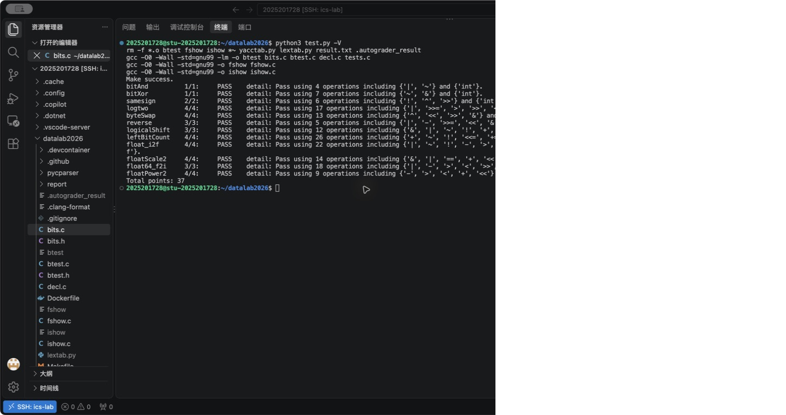

# DataLab 实验报告

姓名：粟羿为  
学号：2025201728  
实验仓库：https://github.com/BAIcai-RUC/datalab2026  
验证日期：2026 年 9 月 28 日  
对应代码提交：`fc9afbb`（Complete Datalab）

## 实验结果

实验在学校 Ubuntu 服务器上完成，通过 VS Code Remote-SSH 编辑代码，使用仓库 Makefile 的 `gcc -O0 -Wall -std=gnu99` 配置编译。在服务器的 `~/datalab2026` 目录执行 `python3 test.py -V`，12 个函数均显示 PASS，总分为 **37/37**。下表运算数来自本次脚本输出，赋值不计入，复合赋值和自增、自减按对应运算计数。

| 函数 | 得分 | 运算数 / 上限 | 结果 |
| --- | --- | --- | --- |
| bitAnd | 1/1 | 4/7 | PASS |
| bitXor | 1/1 | 7/7 | PASS |
| samesign | 2/2 | 6/12 | PASS |
| logtwo | 4/4 | 17/25 | PASS |
| byteSwap | 4/4 | 13/17 | PASS |
| reverse | 3/3 | 5/30 | PASS |
| logicalShift | 3/3 | 12/20 | PASS |
| leftBitCount | 4/4 | 26/50 | PASS |
| float_i2f | 4/4 | 22/30 | PASS |
| floatScale2 | 4/4 | 14/30 | PASS |
| float64_f2i | 3/3 | 18/60 | PASS |
| floatPower2 | 4/4 | 9/30 | PASS |
| 合计 | **37/37** | — | 全部通过 |

byteSwap 按评测脚本的 4 分记录，与题目注释中的 Difficulty 区分。测试通过反映本次课程环境和测试集的结果，可移植性问题另见“调试与边界检查”。

## 解题报告

### 亮点

1. byteSwap：用异或差异掩码交换两个字节，不必分别清空再填入。
2. logtwo 与 leftBitCount：把判断结果变成移位量，分段定位，满足不能使用分支或循环的限制。
3. float_i2f：区分保留位和舍弃位，用最低保留位处理“正好一半”的舍入。

### 1. bitAnd：德摩根律

把按位与改写成 `~(~x | ~y)`。只有两个输入位都为 1 时，取反后的两个输入才都为 0，最终结果为 1。每一位独立满足与运算的真值表，所以对负数的补码位模式也适用。该写法只使用取反和或，共 4 次运算。

### 2. bitXor：排除相同的两种情况

先用 `x & y` 识别“同时为 1”，再用 `(~x) & (~y)` 识别“同时为 0”。分别取反后按位与，保留下来的就是两个输入不同的位。代码用中间变量保存这两种情况，共 7 次运算，恰好达到上限。

### 3. samesign：单独处理零

零既不是正数也不是负数，因此不能只比较符号位。x 为零时返回 `!y`；只有 y 为零时返回 0。其余情况下，`x ^ y` 的最高位表示符号是否不同，再算术右移 31 位并逻辑取反。这样 `(0,0)` 返回 1，`(0,1)` 返回 0，同号的非零数返回 1。

### 4. logtwo：分段查找最高有效位

正整数向下取整的以 2 为底的对数，就是最高有效位的编号。依次判断当前数是否大于 `0xFFFF`、`0xFF`、`0xF`、`3`，把布尔结果变成 16、8、4、2 或 0，再据此右移当前值。最后用剩余值右移一位补上结果的最低位。各阶段位移量占据不同的二进制位，可以按位或合并。例如 13 的最高有效位编号为 3，结果为 3。

### 5. byteSwap：异或差异掩码

用 `(x >> (n << 3)) & 0xFF` 取出第 n 个字节，另一个字节同理，记为 a、b。令 `diff = a ^ b`，把 diff 移到两个字节的位置，与原数异或。因为 `a ^ (a ^ b) = b`，两个位置都会变成对方的内容；其他位与 0 异或保持不变。当 n 与 m 相同时，diff 为 0，结果自然等于原数。

### 6. reverse：固定处理 32 位

每轮先把结果 a 左移一位，再放入 v 的最低位，即 `a = (a << 1) | (v & 1u)`；随后将无符号输入右移。固定执行 32 次，保证原输入的高位零也参与反转。我最初先合并再左移，导致最后一轮多移一次；调整顺序后，输入 `0x00000001` 应得到 `0x80000000`。运算数按源码中的运算符计数，不乘以循环次数。

### 7. logicalShift：分离并恢复最高位

当前实现先用 `1 << 31` 标记最高位，再用 `!!(x & b)` 把它变成 0 或 1。用 `x & ~b` 清除最高位后，剩余部分非负，算术右移不会补 1。最后把保存的位放到编号 `31-n` 的位置，并按位或合并；减法用 `31 + (~n + 1)` 表示。n 为 0 时恢复原数，n 为 31 时只保留原最高位。这里对应实际代码采用的分离最高位方案。

### 8. leftBitCount：取反后统计前导零

先令 v 等于 x 的按位取反，把连续前导 1 转换成连续前导 0。依次检查高 16、8、4、2、1 位是否全零；若是，就把相应长度加入计数，并左移 v，继续检查剩余部分。检查高 8 位要右移 24 位，高 4 位则右移 28 位。五段最多累加 31；若原数全为 1，取反后始终为 0，最后的 `+ !v` 补出第 32 位。

### 9. float_i2f：规格化和舍入

零直接返回零。非零时保存符号并取得大小，把最高有效位左移到编号 31 的位置。阶码从 `31+127=158` 开始，每左移一次减一。对齐后清除最高位的隐含 1，将编号 30 至 8 的位作为 23 位小数部分，低 8 位作为舍入依据。

舍弃部分小于 `0x80` 时不进位，大于时进位；恰好等于时，仅当保留部分最低位为 1 才进位，实现“就近舍入，正好一半取偶数”。最后用加法组合各字段，让小数部分的舍入进位能够进入阶码。当前提交仍在有符号变量 x 上取负和左移，相关边界风险在后文说明。

### 10. floatScale2：按阶码分类

提取符号、8 位阶码和 23 位小数。阶码为 255 时，输入是无穷大或 NaN，原样返回；阶码为 0 时，将小数部分左移并保留符号，也能自然处理非规格化数向规格化数的过渡。普通规格化数将阶码加一。若加一后达到 255，必须清空小数部分并返回带原符号的无穷大，避免误构造为 NaN。

### 11. float64_f2i：拼接需要的整数位

uf2 含符号、11 位阶码和高 20 位小数，uf1 含低 32 位小数。阶码减去 1023 得到实际指数 e。e 小于 0 时返回 0；e 大于 30 时统一返回 `0x80000000`，涵盖越界和特殊值，截断后恰好为最小整数的负数也对应同一编码。

在高 20 位小数前补上隐含 1。e 不超过 20 时，右移高段即可；否则左移高段，并拼入低段右移 `52-e` 位后的内容。右移舍弃小数，最后根据符号取负，实现向零取整。分支也避免了移位量达到 32。

### 12. floatPower2：按指数划分区间

结果恒为正。x 小于 -149 时返回零；-149 至 -127 对应非规格化数，用 `1u << (x+149)` 设置小数部分的一个位；-126 至 127 对应规格化数，只需把 `x+127` 放入阶码；x 大于 127 返回正无穷大。先判断范围再计算，可以避免极端整数输入造成不必要的加法溢出或非法移位。

## 调试与边界检查

修改后先保存并运行 `make`，用 `./btest -f 函数名` 检查正确性，再运行 `python3 test.py -V` 检查全部函数和运算限制。btest 可通过 `-1`、`-2` 指定输入；ishow 帮助对照有符号和无符号解释，fshow 用于观察浮点字段。

需要重点分析的边界包括：samesign 的零，byteSwap 的相同编号，reverse 的固定轮数，logicalShift 的 n=0 和 n=31，leftBitCount 的全零和全一，以及浮点题中的非规格化数、舍入进位、无穷大和 NaN。截图记录了完整脚本结果；这里的边界分析不表示每一项都另存了单独的测试日志。

代码还有可移植性方面的改进点。当前 float_i2f 在有符号 x 上计算 `~x + 1`，最小负数会发生有符号溢出，后续左移到符号位也有标准 C 语义风险。应改用 unsigned 变量保存大小并完成这些运算。其他整数题中的符号位构造和有符号左移也应结合课程约定审查。本次 37 分不等于已经证明代码不存在未定义行为。

## 收获与总结

这次实验让我区分了“数值”与“位模式”，也明确了逻辑取反和按位取反、算术右移和逻辑右移的区别。浮点题需要拆分符号、阶码和小数部分，在边界处分情况处理。调试时先选一个容易手算的输入，对照每一步的位变化，比只看最终分数更容易发现错误。

## 参考的重要资料

1. [课程 README：规则与测试方法](https://github.com/RUCICS2026/datalab2026/blob/main/README.md)。
2. [课程 bits.c：函数定义、合法运算符与限制](https://github.com/RUCICS2026/datalab2026/blob/main/bits.c)。
3. [课程 fshow.c：浮点字段提取与显示](https://github.com/RUCICS2026/datalab2026/blob/main/fshow.c)。
4. [GDB 官方手册：单步执行与运行控制](https://sourceware.org/gdb/current/onlinedocs/gdb.html/Continuing-and-Stepping.html)，用于了解断点与逐行观察变量的方法。

